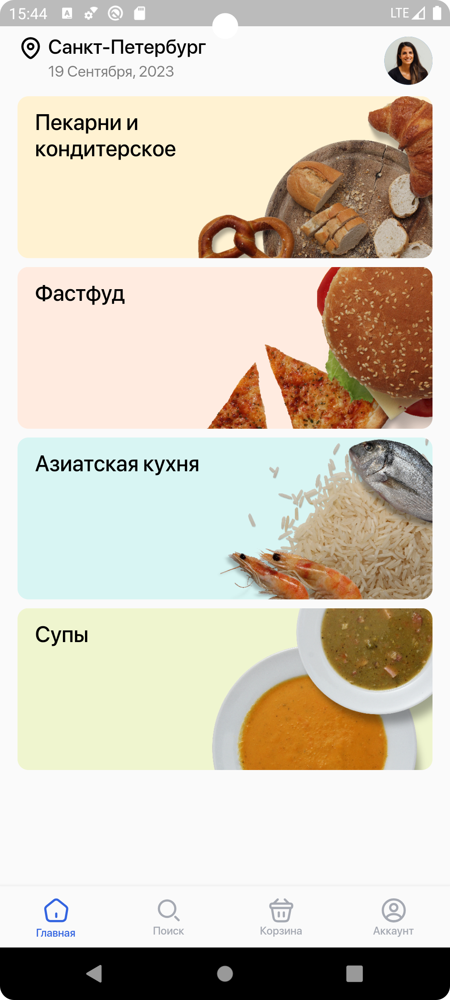
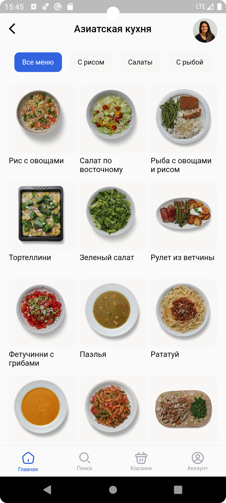
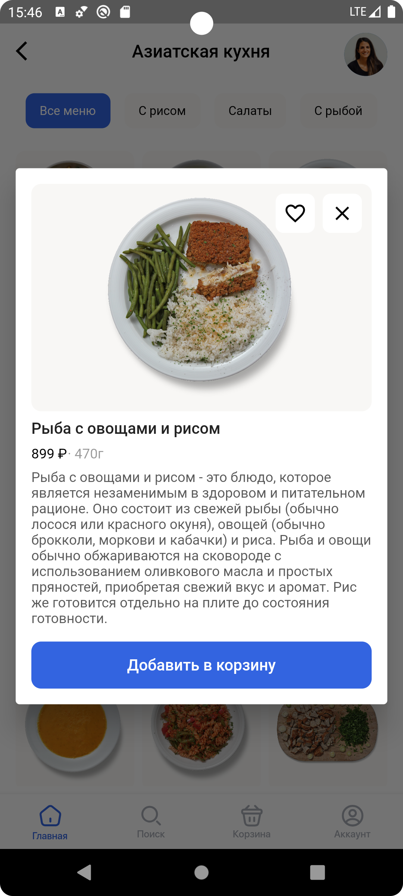
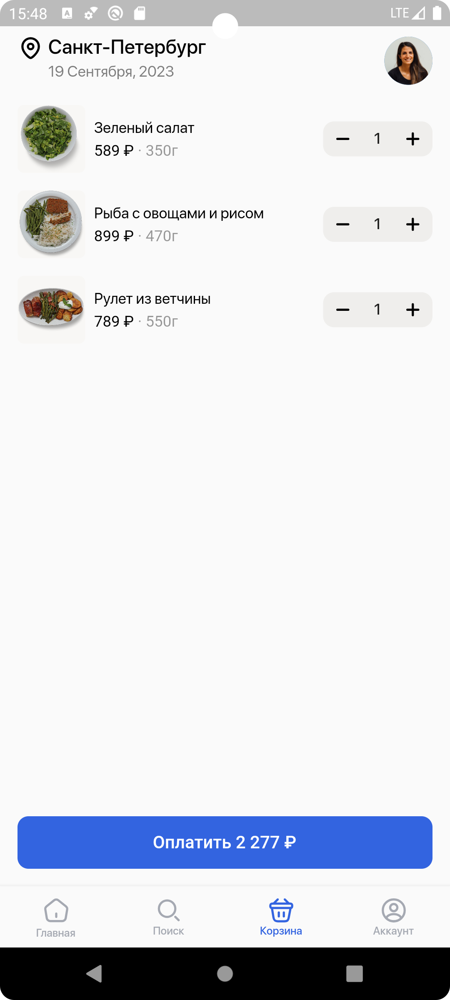

# Тестовое задание "Мобильное приложение доставки еды"
Поддержка Android 10.0+

[Ссылка на тестовое задание](https://docs.google.com/document/d/1xUWCqa3d4EJ87hLar3q4cmd6tfdGmLta/mobilebasic)

## Рекомендуемый стек технологий для Flutter:
* Dart
* Block (Или любой стейт менеджер)
* Clean Architecture
* Retrofit

## Скриншоты приложения:

  
Список категорий (главный экран)

  

  
Категория

    
  

  
Продукт

    
  

  
Корзина

    
  

## Видео работы приложения:
https://github.com/dimalepel/shop_minin_test_app/assets/10213719/01484e61-8601-43b5-88e3-5c5be2f29700

## Скачать приложение можно отсканировав QR-код:

